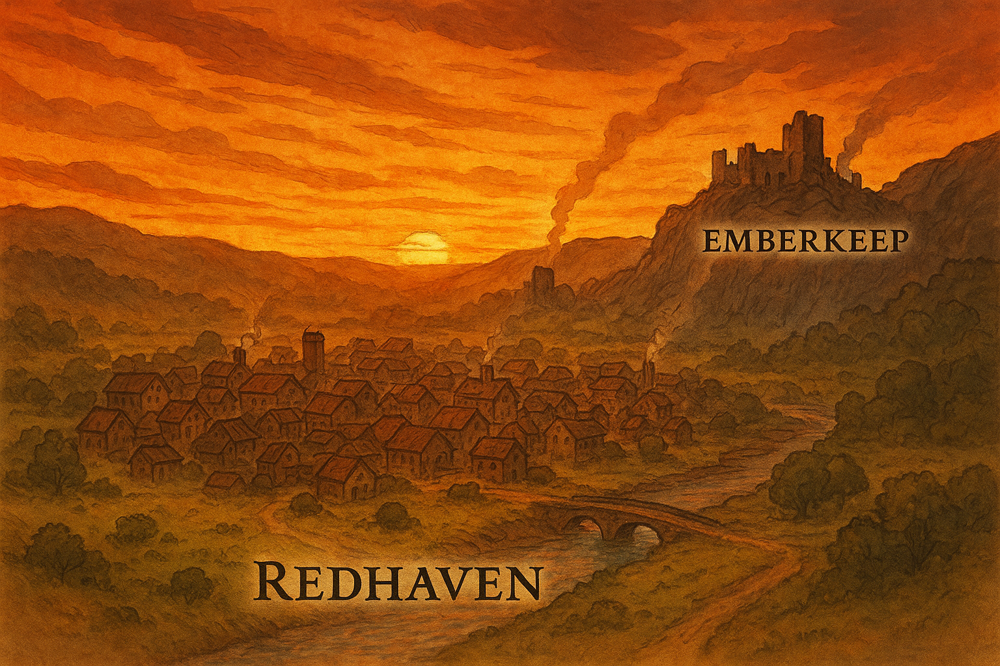

# Ashes of the Emberkeep

_This adventure is for 3-5 players of level 3, and should last 4-6 hours_

You crest a low ridge as the sun sets, painting the sky in streaks of gold and ember-red. 

Below you lies the town of Redhaven, a bustling outpost of miners, smiths, and traders. 
To the east, smoke curls lazily from chimneys, and to the west rises the blackened silhouette of a ruined fortress perched against the cliffs: Emberkeep. 

The wind carries the faint tang of ash and coal. As you make your way into town, the streets are alive with noise — shouting miners, gossiping traders, the clang of a forge. Yet under the surface bustle there is a tension: too many eyes linger on the shadows near the keep, too many conversations fall silent when outsiders pass. 

Something old stirs beneath the ruins, and the town is bracing for it.

