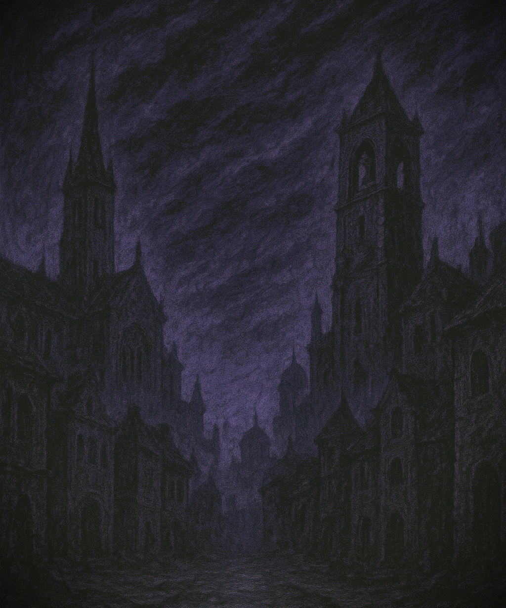

# The Shards of Dusk

_This adventure is for 5-6 players of level 10, and should last 10-12 hours_

The bells of Kaeltharion toll at dusk, though the sky above is already swallowed by roiling bands of violet and black. The once-great city lies under a pall of shadow, streets deserted save for lurking things that move just beyond the torchlight. 

Your party stands upon the broken steps of the Dawnspire, ancient seat of the sunlit order that once kept darkness at bay. 

A desperate sage has warned you: tonight, during the rare Celestial Convergence, the shadow-lord Veythar will claw his way into the world unless the Aegis of Dawn is restored. Its shards are scattered through Kaeltharion, hidden in temples, hoarded by cultists, even bound within creatures of nightmare. 

The more you recover before midnight, the greater your chance to survive what comes. 

The bells fall silent. The city waits, alive with whispers and claws. 

You have twelve hours…