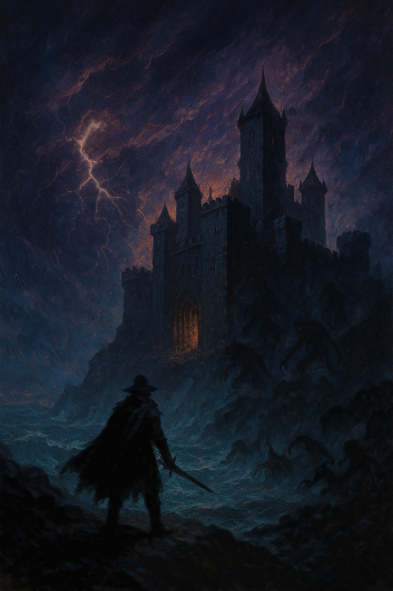

#  The Siege of Blackthorn Hold

_This adventure is for 4-5 players of level 10, and should last 10-12 hours_

The salt-heavy air burns your throat as storm winds lash across the jagged cliffs. 

Before you rises Blackthorn Hold, a brooding fortress of black stone perched against the crashing waves below. The outer walls bear scars of recent battle—splintered gates, scorch marks, and toppled towers. The air hums with unnatural energy, an unsettling vibration that prickles your skin and makes the shadows seem alive.

As you step into the courtyard, silence hangs heavy—too heavy. 

Then, a low, unearthly howl echoes through the storm, joined by dozens more.  
Shapes flicker at the edges of the stormlight, clawing and slithering toward the walls.  
You are not alone, and Blackthorn Hold is no longer abandoned.

Your only certainty: whatever has been unleashed here is not stopping on its own.
