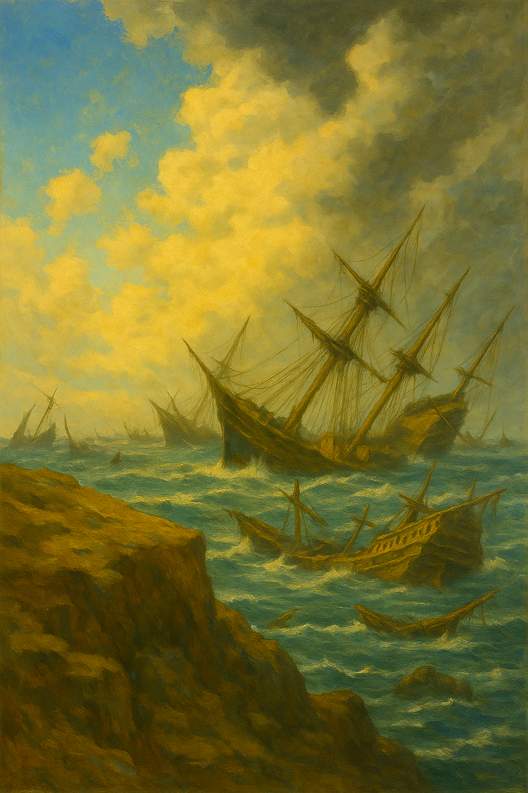

#  Whispers Beneath the Waves

_This adventure is for 4-5 players of level 12, and should last 20+ hours_

The harbor folk speak of a cursed bay where no sailor dares to tread, a stretch of sea where the masts of shattered ships jut like broken teeth from the waves. 

Storms never leave it, and the wrecks groan as if alive. Yet beneath the tangled hulls lies treasure beyond imagining: gold, relics, even forgotten secrets of empires long past.  

Now, fate has brought you to the edge of the graveyard. From a rocky bluff you can see the skeletal shapes of dozens of vessels—merchant galleons split like ripe fruit, pirate sloops half-swallowed by the surf, and warships cracked open on hidden reefs. The tide rolls in, carrying with it the sound of chains, whispers, and faint lantern lights flickering where no living hand could carry them. 

Somewhere within this drowned labyrinth lies what you seek... if you can survive long enough to claim it.